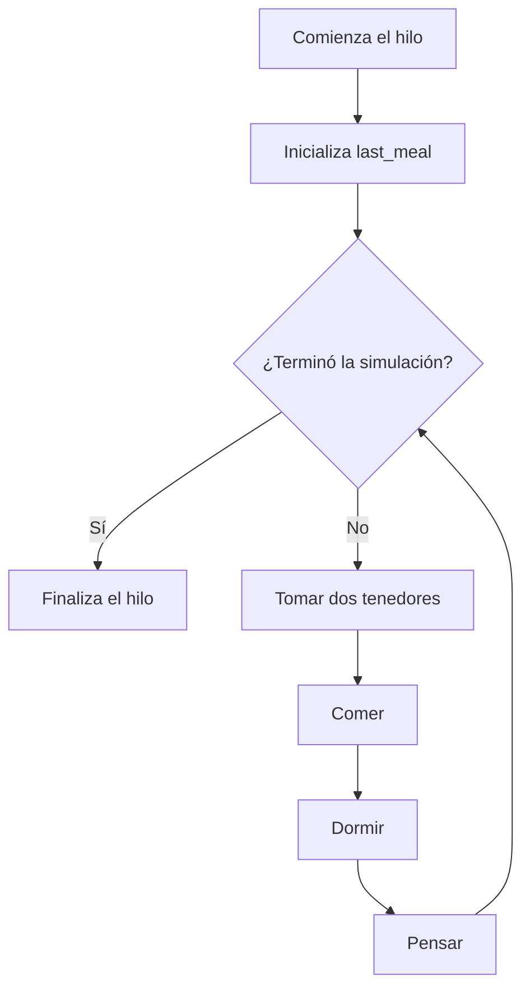

*This project has been created as part of the 42 curriculum by kcarrero.*

# 🍝 Philosophers — philo

## 📖 Description / Descripción

**Philosophers** es un proyecto de programación concurrente en C basado en el problema clásico de **los filósofos comensales**.

Varios filósofos están sentados alrededor de una mesa circular. Cada filósofo alterna entre tres estados:

```text
pensar → comer → dormir → pensar
```

Entre cada pareja de filósofos hay un tenedor. Para poder comer, un filósofo necesita bloquear sus dos tenedores adyacentes. Si pasa más tiempo del permitido sin comenzar una comida, muere y la simulación termina.

La versión `philo` implementa la simulación utilizando:

- 🧵 Un hilo POSIX por filósofo.
- 🔒 Un mutex por tenedor.
- 🍽️ Un mutex individual para proteger la última comida y el contador de comidas.
- 🖨️ Un mutex para serializar los mensajes.
- 🚦 Un mutex para proteger el estado global de la simulación.
- 👁️ Un monitor central que comprueba muertes y la condición opcional de finalización.
- ⏱️ Medición del tiempo en milisegundos.

> [!NOTE]
> Este README documenta la parte obligatoria ubicada en `philosophers/philo`. Esta implementación utiliza **threads y mutexes**; no describe una posible versión bonus basada en procesos y semáforos.

---

## 🎯 Objetivo

El objetivo principal es comprender y controlar los problemas habituales de la programación concurrente:

- **Condiciones de carrera:** varios hilos acceden al mismo dato simultáneamente.
- **Deadlock:** los filósofos quedan bloqueados esperando recursos que nunca se liberan.
- **Starvation:** un filósofo no consigue comer dentro del tiempo disponible.
- **Sincronización:** los datos compartidos deben consultarse y modificarse de forma segura.
- **Planificación:** el orden de ejecución de los hilos depende del sistema operativo.
- **Precisión temporal:** las acciones deben respetar tiempos expresados en milisegundos.
- **Limpieza de recursos:** todos los hilos, mutexes y bloques de memoria deben finalizar correctamente.

La simulación termina cuando ocurre una de estas condiciones:

1. Un filósofo supera `time_to_die` sin comenzar una nueva comida.
2. Todos los filósofos alcanzan `number_of_times_each_philosopher_must_eat`, cuando se proporciona el argumento opcional.

---

## 🪑 Modelo de la mesa

Cada filósofo dispone de un tenedor a su izquierda y otro a su derecha:

```text
                    🍴 0
              ┌─────────────┐
          👤 1               👤 2
       🍴 4                     🍴 1
          👤 5               👤 3
              └───── 👤 4 ───┘
                 🍴 3   🍴 2
```

En el código:

```text
left_fork  = índice del filósofo
right_fork = (índice + 1) % número_de_filósofos
```

El operador módulo conecta el último filósofo con el primer tenedor y mantiene la mesa circular.

---

## 🔄 Ciclo de vida de un filósofo



Cada hilo ejecuta la misma rutina:

1. Inicializa el momento de su última comida.
2. Intenta bloquear sus dos tenedores.
3. Actualiza `last_meal` y `meals_eaten`.
4. Permanece comiendo durante `time_to_eat`.
5. Libera ambos tenedores.
6. Duerme durante `time_to_sleep`.
7. Vuelve a pensar.
8. Repite hasta que la simulación termine.

Los filósofos con identificador par reciben un pequeño retraso inicial para reducir la contención al comenzar todos los hilos.

---

## 🔐 Estrategia de sincronización

### Mutex de los tenedores

La mesa contiene un array de mutexes:

```c
pthread_mutex_t *forks;
```

Cada tenedor solo puede estar bloqueado por un filósofo a la vez.

### Orden de adquisición

Para reducir el riesgo de deadlock, los filósofos no bloquean los tenedores en el mismo orden:

- Los filósofos impares intentan bloquear primero el tenedor izquierdo.
- Los filósofos pares intentan bloquear primero el tenedor derecho.

Esta ruptura de simetría evita que todos los filósofos intenten conservar simultáneamente un tenedor mientras esperan el siguiente.

### Mutex individual de comida

Cada filósofo dispone de `meal_mutex`, que protege:

- `last_meal`
- `meals_eaten`

El hilo del filósofo modifica estos valores mientras el monitor los consulta.

### Mutex del estado

`state_mutex` protege `simulation_end`, la bandera compartida que indica si todos los hilos deben detenerse.

### Mutex de impresión

`print_mutex` evita que dos hilos escriban mensajes mezclados en la terminal.

---

## 👁️ Monitor de la simulación

El hilo principal actúa como monitor después de crear los hilos de los filósofos.

El monitor recorre continuamente el array y comprueba:

```text
tiempo_actual - última_comida > time_to_die
```

Cuando detecta una muerte:

1. Marca la simulación como terminada.
2. Imprime el mensaje `died`.
3. Los filósofos dejan de iniciar nuevas acciones.
4. El proceso principal espera a todos los hilos mediante `pthread_join`.

Cuando existe un límite opcional de comidas, también comprueba que todos los filósofos hayan alcanzado dicho valor.

---

## 🧍 Caso especial: un filósofo

Con un único filósofo solo existe un tenedor.

El filósofo puede tomar ese tenedor, pero nunca puede conseguir un segundo, por lo que no puede comer. La simulación espera hasta alcanzar `time_to_die` y registra su muerte.

Ejemplo:

```bash
./philo 1 800 200 200
```

Salida aproximada:

```text
0 1 has taken a fork
801 1 died
```

Los tiempos exactos pueden variar ligeramente según la carga del sistema y la planificación de los hilos.

---

## 📤 Formato de salida

Cada estado sigue este formato:

```text
timestamp_ms philosopher_id action
```

Ejemplos:

```text
0 1 has taken a fork
0 1 has taken a fork
0 1 is eating
200 1 is sleeping
400 1 is thinking
801 3 died
```

Acciones posibles:

| Mensaje | Significado |
|---|---|
| `has taken a fork` | El filósofo ha bloqueado un tenedor. |
| `is eating` | El filósofo ha comenzado a comer. |
| `is sleeping` | El filósofo está durmiendo. |
| `is thinking` | El filósofo está pensando. |
| `died` | El filósofo ha superado `time_to_die`. |

> [!IMPORTANT]
> El orden exacto de los mensajes no es determinista. Dos ejecuciones con los mismos argumentos pueden producir intercalaciones diferentes porque los hilos son planificados por el sistema operativo.

---

## 📂 Estructura del proyecto

```text
philo/
├── includes/
│   └── philo.h
├── srcs/
│   ├── actions/
│   │   └── actions.c
│   ├── cleanup/
│   │   └── cleanup.c
│   ├── init/
│   │   └── init.c
│   ├── monitor/
│   │   └── monitor.c
│   ├── parse/
│   │   └── parse.c
│   ├── routine/
│   │   └── routine.c
│   ├── time/
│   │   └── time.c
│   ├── utils/
│   │   └── utils.c
│   └── main.c
└── Makefile
```

### Responsabilidad de cada módulo

| Archivo | Responsabilidad |
|---|---|
| `includes/philo.h` | Define `t_table`, `t_philo` y los prototipos del proyecto. |
| `srcs/main.c` | Inicializa valores, valida argumentos y coordina la simulación. |
| `srcs/parse/parse.c` | Valida y convierte los argumentos positivos. |
| `srcs/init/init.c` | Reserva las estructuras e inicializa todos los mutexes. |
| `srcs/routine/routine.c` | Implementa el ciclo principal de cada filósofo. |
| `srcs/actions/actions.c` | Gestiona tenedores, comida, sueño y pensamiento. |
| `srcs/monitor/monitor.c` | Crea los hilos, detecta muertes y comprueba las comidas. |
| `srcs/time/time.c` | Obtiene timestamps y realiza esperas interrumpibles. |
| `srcs/utils/utils.c` | Gestiona el estado compartido y la impresión sincronizada. |
| `srcs/cleanup/cleanup.c` | Destruye mutexes y libera la memoria reservada. |
| `Makefile` | Automatiza la compilación y la limpieza. |

---

## 🛠️ Instructions / Instrucciones

### Requisitos

Para compilar y ejecutar el proyecto se necesita:

- Un sistema compatible con POSIX, como Linux o macOS.
- Un compilador de C con soporte para POSIX Threads.
- La herramienta `make`.
- Opcionalmente, Valgrind o ThreadSanitizer para analizar la concurrencia.

### Clonar el repositorio

```bash
git clone https://github.com/Kentliel/42Madrid_Student.git
cd 42Madrid_Student/philosophers/philo
```

### Compilar

```bash
make
```

El `Makefile` utiliza:

```text
-Wall -Wextra -Werror -pthread
```

La compilación genera el ejecutable:

```text
philo
```

### Objetivos del Makefile

| Comando | Acción |
|---|---|
| `make` | Compila los archivos fuente y genera `philo`. |
| `make clean` | Elimina los archivos objeto. |
| `make fclean` | Elimina los objetos, el ejecutable y la carpeta `objs`. |
| `make re` | Realiza una recompilación completa. |

---

## 🚀 Uso

La sintaxis es:

```bash
./philo number_of_philosophers time_to_die time_to_eat time_to_sleep \
    [number_of_times_each_philosopher_must_eat]
```

### Argumentos

| Argumento | Descripción |
|---|---|
| `number_of_philosophers` | Número de filósofos y de tenedores. |
| `time_to_die` | Tiempo máximo sin comenzar a comer antes de morir. |
| `time_to_eat` | Duración de una comida. |
| `time_to_sleep` | Duración del sueño. |
| `number_of_times_each_philosopher_must_eat` | Límite opcional de comidas por filósofo. |

Todos los tiempos se expresan en **milisegundos**.

La implementación acepta únicamente valores:

- Formados exclusivamente por dígitos.
- Estrictamente mayores que cero.
- Menores o iguales que `2147483647`.

No se aceptan signos, números negativos, decimales ni cadenas vacías.

---

## 🧪 Ejemplos de ejecución

### Simulación sin límite de comidas

```bash
./philo 5 800 200 200
```

La simulación continúa hasta que muera un filósofo o se interrumpa manualmente.

### Finalización por número de comidas

```bash
./philo 5 800 200 200 7
```

La simulación finaliza cuando todos los filósofos han alcanzado siete comidas.

### Un solo filósofo

```bash
./philo 1 800 200 200
```

Permite comprobar el caso en el que es imposible conseguir dos tenedores.

### Configuración con poco margen

```bash
./philo 4 310 200 100
```

Este tipo de configuración sirve para observar la detección de muerte. El resultado concreto puede depender de la planificación del sistema.

### Muchos filósofos

```bash
./philo 100 800 200 200 5
```

Permite observar la contención y verificar que todos los hilos terminen correctamente al alcanzar el límite.

---

## ❌ Gestión de argumentos inválidos

Ejemplos de entradas inválidas:

```bash
./philo
./philo 5 800 200
./philo 0 800 200 200
./philo -5 800 200 200
./philo 5 abc 200 200
./philo 5 800 0 200
./philo 5 800 200 200 0
./philo 2147483648 800 200 200
```

El programa muestra un mensaje de error y termina con código de salida `1`.

Comprobación:

```bash
./philo 0 800 200 200
echo $?
```

Resultado esperado:

```text
1
```

---

## 🧪 Pruebas recomendadas

### Casos funcionales

| Comando | Objetivo |
|---|---|
| `./philo 1 800 200 200` | Comprobar el caso de un único tenedor. |
| `./philo 2 800 200 200 5` | Comprobar la coordinación mínima entre dos hilos. |
| `./philo 4 410 200 200 5` | Observar una mesa con número par de filósofos. |
| `./philo 5 800 200 200 7` | Observar una mesa con número impar y finalización opcional. |
| `./philo 100 800 200 200 3` | Comprobar carga y creación de muchos hilos. |

### Detener una prueba larga

En Linux se puede utilizar `timeout`:

```bash
timeout 10s ./philo 5 800 200 200
```

### Comprobar que solo aparece una muerte

```bash
./philo 4 310 200 100 | grep "died"
```

La salida de una simulación finalizada por muerte debe contener un único mensaje `died`.

### Comprobar el límite de comidas

```bash
./philo 5 800 200 200 7
```

La simulación debe finalizar por sí sola cuando todos hayan alcanzado el límite, sin imprimir una muerte.

> [!WARNING]
> Las pruebas temporales pueden verse afectadas por una máquina saturada, una máquina virtual lenta, herramientas de instrumentación o un depurador.

---

## 🔍 Análisis de memoria y concurrencia

### Valgrind — memoria

Utiliza un límite de comidas para que la ejecución termine:

```bash
valgrind --leak-check=full --show-leak-kinds=all \
    ./philo 5 800 200 200 5
```

### Helgrind — carreras de datos y mutexes

```bash
valgrind --tool=helgrind ./philo 5 800 200 200 5
```

Helgrind puede ayudar a detectar:

- Accesos concurrentes sin protección.
- Orden incorrecto de bloqueos.
- Desbloqueos de mutexes no bloqueados.
- Posibles deadlocks.

### ThreadSanitizer

Recompilar temporalmente con instrumentación:

```bash
make fclean
make CFLAGS="-Wall -Wextra -Werror -pthread -g -fsanitize=thread"
./philo 5 800 200 200 5
```

Después, recuperar la compilación normal:

```bash
make fclean
make
```

> [!NOTE]
> ThreadSanitizer modifica los tiempos de ejecución. Sus resultados sirven para analizar accesos concurrentes, no para evaluar la precisión temporal de la simulación.

### Norminette

```bash
norminette includes srcs
```

---

## ⏱️ Gestión del tiempo

El proyecto obtiene la hora mediante `gettimeofday` y la convierte a milisegundos:

```text
milisegundos = segundos × 1000 + microsegundos ÷ 1000
```

Los timestamps impresos se calculan con respecto a `start_time`, por lo que la simulación comienza aproximadamente en `0 ms`.

La función de espera no realiza un único `usleep` con toda la duración. En su lugar:

1. Guarda el tiempo inicial.
2. Comprueba periódicamente el tiempo transcurrido.
3. Consulta si la simulación ha terminado.
4. Sale cuando alcanza la duración o se activa la condición de finalización.

Este enfoque permite reaccionar antes al final de la simulación.

---

## 🧩 Decisiones técnicas

### Un hilo por filósofo

Cada filósofo necesita avanzar de forma independiente. Los hilos permiten simular acciones concurrentes dentro de un mismo proceso y compartir la mesa.

### Un mutex por tenedor

Un tenedor representa un recurso exclusivo. Un mutex modela directamente que solo un filósofo puede utilizarlo en cada momento.

### Monitor en el hilo principal

Separar la supervisión de las rutinas permite comprobar continuamente el tiempo desde la última comida sin obligar a cada filósofo a detectar su propia muerte.

### Ruptura de simetría

El orden alternado de adquisición y el pequeño retraso inicial de los identificadores pares reducen la posibilidad de que todos los filósofos compitan de la misma manera al mismo tiempo.

### Estado compartido protegido

La bandera de finalización y los datos de comida son consultados por varios hilos, por lo que necesitan sincronización específica para evitar accesos concurrentes inconsistentes.

---

## 📚 Resources / Recursos

### Documentación clásica

- [POSIX — pthread_create](https://pubs.opengroup.org/onlinepubs/9799919799/functions/pthread_create.html)
- [POSIX — pthread_join](https://pubs.opengroup.org/onlinepubs/9799919799/functions/pthread_join.html)
- [POSIX — pthread_mutex_lock](https://pubs.opengroup.org/onlinepubs/9799919799/functions/pthread_mutex_lock.html)
- [POSIX — pthread_mutex_init](https://pubs.opengroup.org/onlinepubs/9799919799/functions/pthread_mutex_destroy.html)
- [POSIX — gettimeofday](https://pubs.opengroup.org/onlinepubs/9799919799/functions/gettimeofday.html)
- [Linux man-pages — pthreads(7)](https://man7.org/linux/man-pages/man7/pthreads.7.html)
- [Linux man-pages — pthread_create(3)](https://man7.org/linux/man-pages/man3/pthread_create.3.html)
- [Linux man-pages — pthread_mutex_lock(3)](https://man7.org/linux/man-pages/man3/pthread_mutex_lock.3.html)
- [Dining Philosophers Problem](https://en.wikipedia.org/wiki/Dining_philosophers_problem)
- [The Little Book of Semaphores](https://greenteapress.com/wp/semaphores/)
- [Valgrind — Helgrind manual](https://valgrind.org/docs/manual/hg-manual.html)
- [Clang — ThreadSanitizer](https://clang.llvm.org/docs/ThreadSanitizer.html)
- [GNU Make manual](https://www.gnu.org/software/make/manual/)
- [Norminette de 42](https://github.com/42School/norminette)
- Enunciado oficial de `Philosophers`, disponible en la intranet de 42.

También resultan útiles las páginas de manual locales:

```bash
man 7 pthreads
man 3 pthread_create
man 3 pthread_join
man 3 pthread_mutex_init
man 3 pthread_mutex_lock
man 3 pthread_mutex_unlock
man 2 gettimeofday
man 3 usleep
```

### 🤖 Uso de inteligencia artificial

La inteligencia artificial se utilizó como **herramienta de apoyo al aprendizaje, análisis y documentación**, concretamente para:

- Explicar el problema de los filósofos comensales y su relación con la concurrencia.
- Comprender la diferencia entre un hilo, un proceso, un mutex y un semáforo.
- Aclarar el ciclo de vida de un hilo creado con `pthread_create` y finalizado con `pthread_join`.
- Explicar cómo un mutex protege un recurso compartido.
- Comprender los conceptos de condición de carrera, deadlock, starvation y exclusión mutua.
- Analizar el orden de adquisición de los tenedores y la ruptura de simetría entre filósofos pares e impares.
- Seguir el flujo entre la rutina de los filósofos y el monitor de la simulación.
- Comprender por qué `last_meal`, `meals_eaten` y `simulation_end` necesitan sincronización.
- Explicar el cálculo de timestamps y el funcionamiento de las esperas interrumpibles.
- Revisar fragmentos de código para identificar qué datos son locales y cuáles son compartidos.
- Proponer casos de prueba para un filósofo, tiempos ajustados, límite de comidas y entradas inválidas.
- Explicar el uso de Helgrind y ThreadSanitizer para revisar problemas de concurrencia.

Las explicaciones generadas mediante IA se utilizaron como material educativo y se contrastaron con la documentación POSIX, las páginas de manual, herramientas de análisis y pruebas realizadas sobre el programa. La implementación, las pruebas y las decisiones finales fueron revisadas y comprendidas por el autor.

---

## 👤 Autor

- **kcarrero** — Estudiante de 42 Madrid
