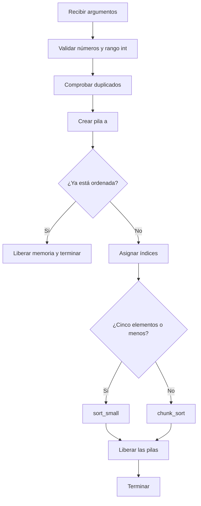

*This project has been created as part of the 42 curriculum by kcarrero.*

# 🔄 push_swap

## 📖 Descripción / Description

**push_swap** es un proyecto algorítmico desarrollado en C cuyo objetivo es ordenar una secuencia de números enteros utilizando dos pilas, `a` y `b`, y un conjunto limitado de operaciones.

Al iniciar el programa:

- Todos los números se almacenan en la pila `a`.
- El primer argumento se encuentra en la parte superior de la pila.
- La pila `b` comienza vacía.
- El programa imprime por la salida estándar las instrucciones necesarias para ordenar `a` de menor a mayor.

El reto no consiste únicamente en ordenar los valores correctamente, sino en generar una secuencia de movimientos lo más eficiente posible.

Durante el proyecto se trabajan conceptos como:

- 🧱 Pilas y listas enlazadas.
- 🔗 Manipulación de nodos y punteros.
- 🔢 Normalización de valores mediante índices.
- 🧩 Diseño de algoritmos de ordenación.
- 📊 Análisis del número de operaciones.
- ✅ Validación rigurosa de argumentos.
- 🧹 Gestión de memoria dinámica.
- 🛠️ Organización modular y compilación con `Makefile`.

> [!NOTE]
> La implementación principal utiliza una estrategia específica para listas pequeñas y una ordenación basada en **chunks** para entradas mayores. El repositorio también contiene una implementación de **radix sort**, aunque el flujo principal actual no la ejecuta.

---

## 🎯 Objetivo

Dada una secuencia desordenada:

```text
Pila a          Pila b
┌─────┐         ┌─────┐
│  3  │  ← top  │     │
│  1  │         │     │
│  2  │         │     │
└─────┘         └─────┘
```

El programa debe producir instrucciones válidas, por ejemplo:

```text
ra
sa
```

Después de aplicar las instrucciones, la pila `a` debe quedar ordenada:

```text
Pila a          Pila b
┌─────┐         ┌─────┐
│  1  │  ← top  │     │
│  2  │         │     │
│  3  │         │     │
└─────┘         └─────┘
```

La pila `b` debe terminar vacía.

---

## ⚙️ Operaciones permitidas

### Intercambio

| Operación | Descripción |
|---|---|
| `sa` | Intercambia los dos primeros elementos de `a`. |
| `sb` | Intercambia los dos primeros elementos de `b`. |
| `ss` | Ejecuta `sa` y `sb` simultáneamente. |

### Push

| Operación | Descripción |
|---|---|
| `pa` | Mueve el primer elemento de `b` a la parte superior de `a`. |
| `pb` | Mueve el primer elemento de `a` a la parte superior de `b`. |

### Rotación

| Operación | Descripción |
|---|---|
| `ra` | Desplaza todos los elementos de `a` una posición hacia arriba. El primero pasa al final. |
| `rb` | Desplaza todos los elementos de `b` una posición hacia arriba. El primero pasa al final. |
| `rr` | Ejecuta `ra` y `rb` simultáneamente. |

### Rotación inversa

| Operación | Descripción |
|---|---|
| `rra` | Desplaza todos los elementos de `a` una posición hacia abajo. El último pasa al principio. |
| `rrb` | Desplaza todos los elementos de `b` una posición hacia abajo. El último pasa al principio. |
| `rrr` | Ejecuta `rra` y `rrb` simultáneamente. |

---

## 🧠 Estrategia de ordenación

### 1. Validación de la entrada

Antes de ordenar, el programa comprueba que:

- Todos los argumentos representen números enteros.
- Los signos `+` y `-` estén correctamente colocados.
- Los valores estén dentro del rango de un `int`.
- No existan números duplicados.
- Los argumentos no estén vacíos ni contengan únicamente espacios.
- La memoria necesaria pueda reservarse correctamente.

Los argumentos pueden recibirse por separado:

```bash
./push_swap 4 2 7 1 3
```

O dentro de una única cadena:

```bash
./push_swap "4 2 7 1 3"
```

También pueden combinarse varios argumentos con grupos de números:

```bash
./push_swap "4 2" 7 "1 3"
```

> [!IMPORTANT]
> En caso de entrada inválida, el programa escribe `Error` en la salida de error estándar y termina con código de salida `1`.

### 2. Creación de las pilas

Cada número se guarda en un nodo de una lista enlazada:

```c
typedef struct s_node
{
    int             value;
    int             index;
    struct s_node   *next;
}   t_node;
```

La estructura principal mantiene las dos pilas y sus tamaños:

```c
typedef struct s_stack
{
    t_node  *a;
    t_node  *b;
    int     size_a;
    int     size_b;
}   t_stack;
```

### 3. Indexación de los valores

Los valores originales se convierten en índices consecutivos según su posición en el orden ascendente.

Ejemplo:

```text
Valores:  40  -5  100  12
Índices:   2   0    3   1
```

Esta normalización permite trabajar con valores entre `0` y `n - 1`, independientemente de si los números originales son negativos, muy grandes o están muy separados entre sí.

Para crear los índices, la implementación:

1. Copia los valores a un array.
2. Ordena el array.
3. Asigna a cada nodo la posición correspondiente dentro del array ordenado.

### 4. Listas de hasta cinco elementos

Para `2` o `3` elementos se utilizan casos específicos con un número reducido de movimientos.

Para `4` o `5` elementos:

1. Se localiza el elemento con el índice más pequeño.
2. Se rota la pila en la dirección más corta.
3. El mínimo se envía a `b`.
4. Se repite hasta dejar tres elementos en `a`.
5. Se ordenan los tres elementos restantes.
6. Los mínimos se devuelven a `a` mediante `pa`.

### 5. Listas de más de cinco elementos

La implementación principal utiliza una estrategia basada en **chunks**:

- Para listas de hasta `100` elementos se usa un chunk de `15`.
- Para listas mayores se usa un chunk de `30`.

Durante la primera fase, los elementos se trasladan progresivamente de `a` a `b` según su índice. Algunas rotaciones de `b` ayudan a distribuir los valores y reducir movimientos posteriores.

Durante la segunda fase:

1. Se localiza el índice máximo de `b`.
2. Se calcula su posición.
3. Se utiliza `rb` o `rrb`, según cuál sea el recorrido más corto.
4. El máximo se devuelve a `a` con `pa`.
5. El proceso continúa hasta vaciar `b`.

El resultado final es una pila `a` ordenada de menor a mayor.

### 6. Implementación de radix sort

El archivo `srcs/sort/radix_sort.c` contiene una implementación de **radix sort binario** basada en los índices normalizados.

Esta función procesa cada bit mediante:

- `ra` cuando el bit actual es `1`.
- `pb` cuando el bit actual es `0`.
- `pa` para devolver todos los elementos a `a` después de cada pasada.

En la versión actual, `main.c` selecciona `sort_small` o `chunk_sort`, por lo que `radix_sort` queda disponible como estrategia alternativa y material de estudio.

---

## 🔀 Flujo del programa



---

## 📂 Estructura del proyecto

```text
push_swap/
├── includes/
│   └── push_swap.h
├── libft/
│   ├── includes/
│   ├── srcs/
│   └── Makefile
├── srcs/
│   ├── operations/
│   │   ├── push.c
│   │   ├── reverse_rotate.c
│   │   ├── rotate.c
│   │   └── swap.c
│   ├── parsing/
│   │   ├── parse_args.c
│   │   └── parse_utils.c
│   ├── sort/
│   │   ├── chunk_sort.c
│   │   ├── chunk_utils.c
│   │   ├── index_stack.c
│   │   ├── radix_sort.c
│   │   └── sort_small.c
│   ├── stack/
│   │   ├── stack_new.c
│   │   └── stack_utils.c
│   ├── utils/
│   │   └── error_exit.c
│   └── main.c
├── checker_linux
└── Makefile
```

### Responsabilidad de cada módulo

| Módulo | Responsabilidad |
|---|---|
| `main.c` | Inicializa las pilas, procesa la entrada y selecciona el algoritmo. |
| `parsing/` | Separa, valida y convierte los argumentos recibidos. |
| `stack/` | Crea, recorre, comprueba y libera las listas enlazadas. |
| `operations/` | Implementa las once instrucciones permitidas. |
| `index_stack.c` | Normaliza los valores asignándoles índices consecutivos. |
| `sort_small.c` | Ordena listas de hasta cinco elementos. |
| `chunk_sort.c` | Ordena listas mayores utilizando chunks. |
| `chunk_utils.c` | Localiza índices y posiciones dentro de las pilas. |
| `radix_sort.c` | Implementa radix sort binario como estrategia alternativa. |
| `error_exit.c` | Muestra errores, libera las pilas y termina el programa. |
| `libft/` | Biblioteca personal utilizada por el proyecto. |
| `checker_linux` | Comprueba si una secuencia de operaciones ordena correctamente la entrada. |
| `Makefile` | Automatiza la compilación y la limpieza. |

---

## 🛠️ Instrucciones / Instructions

### Requisitos

Para compilar el proyecto se necesita:

- Un sistema compatible con Unix, como Linux o macOS.
- Un compilador de C, como `cc`, `gcc` o `clang`.
- La herramienta `make`.
- Opcionalmente, `Valgrind` y `Norminette` para realizar comprobaciones adicionales.

### Clonar el repositorio

```bash
git clone https://github.com/Kentliel/42Madrid_Student.git
cd 42Madrid_Student/push_swap
```

### Compilar

```bash
make
```

El proyecto se compila con:

```text
-Wall -Wextra -Werror
```

La compilación genera el ejecutable:

```text
push_swap
```

### Objetivos del Makefile

| Comando | Acción |
|---|---|
| `make` | Compila `libft` y genera el ejecutable `push_swap`. |
| `make clean` | Elimina los archivos objeto del proyecto y de `libft`. |
| `make fclean` | Elimina los objetos, el ejecutable y la biblioteca generada. |
| `make re` | Realiza una recompilación completa. |

---

## 🚀 Uso

### Argumentos separados

```bash
./push_swap 3 2 1
```

Posible salida:

```text
sa
rra
```

### Una única cadena

```bash
./push_swap "3 2 1"
```

### Números negativos

```bash
./push_swap 10 -3 7 0 -20
```

### Entrada ya ordenada

```bash
./push_swap 1 2 3 4 5
```

En este caso, el programa no imprime ninguna operación.

### Sin argumentos

```bash
./push_swap
```

El programa termina sin imprimir nada.

---

## ✅ Verificación con checker

El repositorio incluye el binario `checker_linux`.

Primero, asegúrate de que tenga permiso de ejecución:

```bash
chmod +x checker_linux
```

Después, envía la salida de `push_swap` al checker:

```bash
./push_swap 3 2 1 | ./checker_linux 3 2 1
```

Resultado correcto:

```text
OK
```

Resultado incorrecto:

```text
KO
```

Para una cadena de argumentos:

```bash
ARG="8 3 5 1 9 2 7 4 6"
./push_swap $ARG | ./checker_linux $ARG
```

> [!NOTE]
> `checker_linux` es un ejecutable para Linux. En macOS debe utilizarse un checker compatible con ese sistema.

---

## 📊 Medición del rendimiento

### Contar operaciones

```bash
./push_swap 5 2 8 1 9 3 7 4 6 | wc -l
```

### Probar 100 números aleatorios

En Linux:

```bash
ARG=$(shuf -i 1-1000 -n 100)
./push_swap $ARG | ./checker_linux $ARG
./push_swap $ARG | wc -l
```

### Probar 500 números aleatorios

```bash
ARG=$(shuf -i 1-10000 -n 500)
./push_swap $ARG | ./checker_linux $ARG
./push_swap $ARG | wc -l
```

Cada conjunto aleatorio debe contener valores únicos.

---

## 🧪 Pruebas recomendadas

### Entradas válidas

```bash
./push_swap 2 1
./push_swap 3 2 1
./push_swap 5 1 4 2 3
./push_swap "5 1 4 2 3"
./push_swap 2147483647 0 -2147483648
```

### Entradas inválidas

```bash
./push_swap 1 2 2
./push_swap 1 hola 3
./push_swap 2147483648
./push_swap -2147483649
./push_swap "+"
./push_swap ""
./push_swap "   "
./push_swap 4 2 " 7 1"
```

Las entradas inválidas deben producir:

```text
Error
```

### Comprobar el código de salida

```bash
./push_swap 1 2 2
echo $?
```

Resultado esperado:

```text
1
```

### Comprobar fugas de memoria

```bash
valgrind --leak-check=full --show-leak-kinds=all \
    ./push_swap 8 3 5 1 9 2 7 4 6
```

También se pueden comprobar descriptores abiertos:

```bash
valgrind --leak-check=full --track-fds=yes \
    ./push_swap 8 3 5 1 9 2 7 4 6
```

### Comprobar el estilo

```bash
norminette includes srcs libft
```

---

## ⚠️ Gestión de errores

El programa muestra `Error` cuando encuentra:

- Caracteres no numéricos.
- Un signo sin dígitos.
- Valores fuera del rango `INT_MIN`–`INT_MAX`.
- Números duplicados.
- Argumentos vacíos.
- Argumentos formados únicamente por espacios.
- Fallos de reserva de memoria.

Los mensajes de error se escriben en `stderr`.

Ejemplo:

```bash
./push_swap 1 2 dos 3 2> error.txt
cat error.txt
```

---

## 🧩 Decisiones técnicas

### Listas enlazadas

Las pilas se representan mediante listas enlazadas simples. Esto permite cambiar el nodo superior y mover elementos entre pilas sin desplazar bloques completos de memoria.

### Índices normalizados

Los valores originales se conservan, pero cada nodo recibe un índice. Esto simplifica las comparaciones y permite que los algoritmos trabajen con un rango consecutivo.

### Rotación más corta

Cuando se busca un elemento concreto, su posición se compara con la mitad del tamaño de la pila:

- Si está en la primera mitad, se utilizan rotaciones.
- Si está en la segunda mitad, se utilizan rotaciones inversas.

### Algoritmos separados por tamaño

Las entradas pequeñas se benefician de casos específicos, mientras que las entradas grandes necesitan una estrategia más general. Esta separación evita aplicar un algoritmo costoso a listas muy pequeñas.

---

## 📚 Recursos / Resources

### Documentación clásica

- [Stack — estructura de datos abstracta](https://en.wikipedia.org/wiki/Stack_(abstract_data_type))
- [Lista enlazada — estructura de datos](https://en.wikipedia.org/wiki/Linked_list)
- [Algoritmos de ordenación](https://en.wikipedia.org/wiki/Sorting_algorithm)
- [Radix sort](https://en.wikipedia.org/wiki/Radix_sort)
- [Referencia del lenguaje C — cppreference](https://en.cppreference.com/w/c/)
- [Manual de la biblioteca GNU C](https://www.gnu.org/software/libc/manual/)
- [Manual de GNU Make](https://www.gnu.org/software/make/manual/)
- [Documentación de Valgrind](https://valgrind.org/docs/manual/manual.html)
- [Norminette de 42](https://github.com/42School/norminette)
- Enunciado oficial de `push_swap`, disponible en la intranet de 42.

También resultan útiles las páginas de manual disponibles desde la terminal:

```bash
man 3 malloc
man 3 free
man 2 write
```

---

## Extras

**Linked lists**
* https://www.tutorialesprogramacionya.com/estructurasdedatos/listasenlazadasc/tema8.html?utm_source=copilot.com

**atol**
* https://www.geeksforgeeks.org/c/atol-atoll-and-atof-functions-in-c-c/?utm_source=copilot.com

**Chunk**
* https://deepwiki.com/nach131/push_swap/4.3-chunk-based-sorting?utm_source=copilot.com

---

## 🤖 Uso de inteligencia artificial

La inteligencia artificial se utilizó como **herramienta de apoyo al aprendizaje, análisis y documentación**, concretamente para:

- Explicar el funcionamiento de las pilas y su representación mediante listas enlazadas.
- Comprender cómo las operaciones `swap`, `push`, `rotate` y `reverse rotate` modifican los nodos.
- Aclarar la normalización de números mediante índices consecutivos.
- Explicar las diferencias entre una estrategia basada en chunks y radix sort.
- Entender el procesamiento bit a bit utilizado por radix sort.
- Analizar fragmentos del código para seguir el flujo entre el parser, las pilas, las operaciones y los algoritmos.
- Revisar la lógica para ordenar casos de dos, tres, cuatro y cinco elementos.
- Comprender cómo elegir entre rotación y rotación inversa según la posición de un nodo.
- Proponer casos de prueba para duplicados, límites de `int`, signos, cadenas vacías y entradas ya ordenadas.
- Ayudar a localizar puntos que requerían revisión manual en la gestión de memoria y el tratamiento de errores.

Las explicaciones generadas mediante IA se utilizaron como material educativo y se contrastaron con el enunciado del proyecto, documentación clásica, pruebas con el checker y revisión manual del código. La implementación y las decisiones finales fueron realizadas, comprobadas y comprendidas por el autor.

---

## 👤 Autor

- **kcarrero** — Estudiante de 42 Madrid
