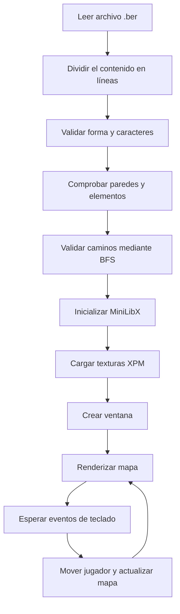

*This project has been created as part of the 42 curriculum by kcarrero.*

# 🎮 so_long

## 📖 Descripción / Description

**so_long** es un pequeño videojuego 2D desarrollado en C como parte del currículo de 42. El proyecto utiliza **MiniLibX**, una biblioteca gráfica basada en X11, para crear una ventana, dibujar el mapa y gestionar la interacción del jugador.

El objetivo del juego es recorrer un mapa, recoger todos los coleccionables y llegar a la salida utilizando el menor número posible de movimientos.

Durante el desarrollo se trabajan conceptos como:

- 🪟 Creación y gestión de ventanas.
- 🖼️ Carga y renderizado de imágenes XPM.
- ⌨️ Gestión de eventos de teclado y cierre de ventana.
- 🗺️ Lectura, representación y validación de mapas.
- 🧭 Comprobación de caminos mediante búsqueda en anchura — **BFS**.
- 🧱 Organización modular de un proyecto en C.
- 🧹 Gestión de memoria y liberación de recursos gráficos.
- 🛠️ Compilación de bibliotecas estáticas mediante `Makefile`.

> [!NOTE]
> La implementación incluida en este repositorio corresponde a la parte obligatoria del proyecto y está preparada para ejecutarse en **Linux** con MiniLibX y X11.

---

## 🎯 Objetivo del juego

Para completar una partida, el jugador debe:

1. Recorrer el mapa evitando las paredes.
2. Recoger todos los coleccionables.
3. Alcanzar la salida después de haber recogido todos los objetos.

La salida permanece bloqueada mientras quede algún coleccionable pendiente.

```text
Jugador → Coleccionables → Salida
   P            C           E
```

Cada movimiento válido incrementa el contador, que se muestra tanto en la terminal como dentro de la ventana del juego.

---

## ✨ Características

- Renderizado de mapas por tiles de **64 × 64 píxeles**.
- Sprites distintos según la dirección del jugador.
- Movimiento mediante las teclas `W`, `A`, `S` y `D`.
- Cierre limpio mediante `ESC` o el botón de cierre de la ventana.
- Contador de movimientos visible en pantalla.
- Validación completa del formato `.ber`.
- Detección de mapas no rectangulares o no cerrados.
- Validación del número de jugadores, salidas y coleccionables.
- Detección de caracteres no permitidos.
- Verificación de que todos los coleccionables y la salida sean alcanzables.
- Gestión y liberación de mapas, imágenes, ventana y conexión gráfica.

---

## 🕹️ Controles

| Tecla | Acción |
|---|---|
| `W` | Mover hacia arriba |
| `A` | Mover hacia la izquierda |
| `S` | Mover hacia abajo |
| `D` | Mover hacia la derecha |
| `ESC` | Cerrar el juego |
| Botón `X` | Cerrar la ventana |

---

## 🗺️ Formato de los mapas

Los mapas deben ser archivos de texto con extensión `.ber`.

### Símbolos permitidos

| Símbolo | Elemento |
|---|---|
| `0` | Suelo transitable |
| `1` | Pared |
| `C` | Coleccionable |
| `E` | Salida |
| `P` | Posición inicial del jugador |

### Reglas de validación

Un mapa válido debe:

- Tener extensión `.ber`.
- Ser rectangular.
- Estar completamente rodeado por paredes.
- Contener exactamente un jugador `P`.
- Contener exactamente una salida `E`.
- Contener al menos un coleccionable `C`.
- Utilizar únicamente los caracteres `0`, `1`, `C`, `E` y `P`.
- Permitir llegar desde el jugador hasta todos los coleccionables y la salida.

La accesibilidad se comprueba mediante un algoritmo **BFS** que recorre las posiciones transitables desde la ubicación inicial del jugador.

### Ejemplo de mapa válido

```text
1111111111
1P000000C1
1000110001
1C000000E1
1000110001
1000000001
1111111111
```

---

## 🧠 Funcionamiento interno



### Flujo principal

1. Se comprueba que el programa reciba un único archivo de mapa.
2. El archivo se lee y se divide en filas.
3. El parser valida la estructura y el contenido.
4. BFS comprueba que exista un recorrido válido.
5. MiniLibX inicializa la conexión gráfica.
6. Se cargan las texturas XPM.
7. Se crea una ventana adaptada al tamaño del mapa.
8. Se renderizan el suelo, las paredes, los objetos, la salida y el jugador.
9. Los eventos de teclado actualizan la posición y vuelven a dibujar el mapa.
10. Al terminar, se destruyen las imágenes, la ventana y el contexto gráfico.

---

## 📂 Estructura del proyecto

```text
so_long/
├── includes/
│   └── so_long.h
├── libft/
│   ├── includes/
│   ├── srcs/
│   └── Makefile
├── maps/
│   ├── map1.ber
│   ├── map2.ber
│   ├── map3.ber
│   ├── map4.ber
│   ├── map5.ber
│   ├── map6.ber
│   └── mapa.ber
├── minilibx-linux/
├── srcs/
│   ├── game/
│   │   ├── game_images.c
│   │   ├── game_move.c
│   │   ├── init_game.c
│   │   └── render_map.c
│   ├── parser/
│   │   ├── parser_checks.c
│   │   ├── parser_main.c
│   │   └── parser_path.c
│   ├── utils/
│   │   ├── utils_file.c
│   │   └── utils_split.c
│   └── main.c
├── textures/
│   ├── collect_game.xpm
│   ├── exit_game.xpm
│   ├── floor_game.xpm
│   ├── player_back.xpm
│   ├── player_front.xpm
│   ├── player_left.xpm
│   ├── player_right.xpm
│   └── wall_tree.xpm
└── Makefile
```

### Responsabilidad de cada módulo

| Módulo | Responsabilidad |
|---|---|
| `main.c` | Comprueba los argumentos, inicia el parser y arranca el bucle gráfico. |
| `parser_main.c` | Coordina la lectura y validación completa del mapa. |
| `parser_checks.c` | Valida la forma, los bordes, los caracteres y las cantidades. |
| `parser_path.c` | Comprueba mediante BFS que exista un camino válido. |
| `init_game.c` | Inicializa MiniLibX, crea la ventana y registra los eventos. |
| `game_images.c` | Carga y libera las texturas XPM. |
| `render_map.c` | Dibuja el mapa y el contador de movimientos. |
| `game_move.c` | Valida y procesa los movimientos del jugador. |
| `utils/` | Contiene funciones auxiliares para leer y dividir archivos. |
| `libft/` | Biblioteca personal utilizada por el proyecto. |

---

## 🛠️ Instrucciones / Instructions

### Requisitos

El proyecto está configurado para Linux y necesita:

- `gcc` o `cc`
- `make`
- X11
- Extensión XShm
- Archivos de desarrollo BSD

En Debian o Ubuntu se pueden instalar las dependencias con:

```bash
sudo apt update
sudo apt install gcc make xorg libxext-dev libbsd-dev
```

> [!IMPORTANT]
> La carpeta `minilibx-linux` ya está incluida en el repositorio y se compila automáticamente mediante el `Makefile`.

### Clonar el repositorio

```bash
git clone https://github.com/Kentliel/42Madrid_Student.git
cd 42Madrid_Student/so_long
```

### Compilar

```bash
make
```

La compilación utiliza:

```text
-Wall -Wextra -Werror
```

El proceso compila:

1. `libft`
2. `minilibx-linux`
3. Los archivos fuente de `so_long`
4. El ejecutable final `so_long`

### Objetivos del Makefile

| Comando | Acción |
|---|---|
| `make` | Compila las bibliotecas y genera `so_long`. |
| `make clean` | Elimina los archivos objeto. |
| `make fclean` | Elimina los objetos, el ejecutable y las bibliotecas generadas. |
| `make re` | Realiza una recompilación completa. |

---

## 🚀 Ejecución

La sintaxis es:

```bash
./so_long <mapa.ber>
```

Ejemplo:

```bash
./so_long maps/map1.ber
```

También se pueden probar los demás mapas incluidos:

```bash
./so_long maps/map2.ber
./so_long maps/map3.ber
./so_long maps/map4.ber
```

> [!WARNING]
> El ejecutable debe iniciarse desde la carpeta raíz de `so_long`, ya que las texturas se cargan mediante rutas relativas como `textures/wall_tree.xpm`.

---

## 🧪 Pruebas recomendadas

### Mapas válidos

Comprobar mapas con:

- Diferentes dimensiones.
- Varios coleccionables.
- Caminos estrechos.
- Distintas posiciones iniciales.
- Salidas alejadas del jugador.

### Mapas inválidos

Se recomienda crear casos que incluyan:

- Extensión distinta de `.ber`.
- Archivo vacío.
- Mapa no rectangular.
- Bordes abiertos.
- Ningún jugador.
- Más de un jugador.
- Ninguna salida.
- Más de una salida.
- Ningún coleccionable.
- Caracteres desconocidos.
- Coleccionables inaccesibles.
- Salida inaccesible.

Ejemplo:

```bash
./so_long maps/mapa_invalido.ber
```

El programa debe terminar mostrando un mensaje que comience por:

```text
ERROR
```

### Comprobar el estilo

```bash
norminette includes srcs libft
```

### Comprobar fugas de memoria

En Linux:

```bash
valgrind --leak-check=full --show-leak-kinds=all ./so_long maps/map1.ber
```

Para revisar también los descriptores abiertos:

```bash
valgrind --leak-check=full --track-fds=yes ./so_long maps/map1.ber
```

> [!NOTE]
> MiniLibX y X11 pueden mostrar asignaciones internas que no pertenecen directamente al código del proyecto. Es importante distinguirlas de la memoria reservada por `so_long`.

---

## ⚠️ Solución de problemas

### `mlx.h: No such file or directory`

Comprueba que la carpeta `minilibx-linux` exista dentro del proyecto y vuelve a compilar:

```bash
make re
```

### Errores relacionados con X11

Instala las dependencias gráficas:

```bash
sudo apt install xorg libxext-dev libbsd-dev
```

### No se cargan las texturas

Ejecuta el programa desde la raíz del proyecto:

```bash
cd 42Madrid_Student/so_long
./so_long maps/map1.ber
```

### No se abre la ventana

El programa necesita una sesión gráfica con acceso a un servidor X11. No funcionará correctamente en una terminal sin entorno gráfico salvo que se configure un servidor X.

---

## 🔧 Principales funciones de MiniLibX

| Función | Uso |
|---|---|
| `mlx_init` | Inicializa la conexión con el sistema gráfico. |
| `mlx_new_window` | Crea la ventana del juego. |
| `mlx_xpm_file_to_image` | Convierte una textura XPM en una imagen de MiniLibX. |
| `mlx_put_image_to_window` | Dibuja una imagen dentro de la ventana. |
| `mlx_string_put` | Muestra el contador de movimientos. |
| `mlx_key_hook` | Registra eventos del teclado. |
| `mlx_hook` | Gestiona el evento de cierre de la ventana. |
| `mlx_loop` | Mantiene activo el bucle de eventos. |
| `mlx_destroy_image` | Libera una imagen cargada. |
| `mlx_destroy_window` | Destruye la ventana. |
| `mlx_destroy_display` | Cierra la conexión gráfica en Linux. |

---

## 📚 Recursos / Resources

### Documentación clásica

- [MiniLibX para Linux — repositorio de 42Paris](https://github.com/42Paris/minilibx-linux)
- [Manual de Xlib — X.Org](https://www.x.org/releases/current/doc/libX11/libX11/libX11.html)
- [Documentación de eventos de Xlib](https://tronche.com/gui/x/xlib/events/)
- [Breadth-First Search — VisuAlgo](https://visualgo.net/en/dfsbfs)
- [Breadth-First Search — GeeksforGeeks](https://www.geeksforgeeks.org/breadth-first-search-or-bfs-for-a-graph/)
- [Referencia del lenguaje C — cppreference](https://en.cppreference.com/w/c/)
- [Manual de la biblioteca estándar de GNU C](https://www.gnu.org/software/libc/manual/)
- [Linux man-pages](https://man7.org/linux/man-pages/)
- [Norminette de 42](https://github.com/42School/norminette)

También resultan útiles las páginas de manual incluidas con MiniLibX:

```bash
man mlx
man mlx_new_window
man mlx_pixel_put
man mlx_new_image
man mlx_loop
```

### 🤖 Uso de inteligencia artificial

La inteligencia artificial se utilizó como **herramienta de apoyo al aprendizaje, revisión y documentación** en los siguientes puntos:

- Explicar el funcionamiento general de MiniLibX y su bucle de eventos.
- Comprender la relación entre el mapa lógico y su representación gráfica mediante tiles.
- Aclarar el uso de `mlx_init`, `mlx_new_window`, `mlx_hook`, `mlx_key_hook` y `mlx_loop`.
- Entender la carga, renderización y liberación de imágenes XPM.
- Analizar fragmentos de código para comprender la responsabilidad de las estructuras `t_map` y `t_game`.
- Explicar el algoritmo BFS utilizado para comprobar que los coleccionables y la salida fueran alcanzables.
- Revisar la lógica de movimiento, recogida de objetos y desbloqueo de la salida.
- Proponer casos límite para probar el parser de mapas.
- Ayudar a identificar puntos que requerían una revisión manual, especialmente en la gestión de memoria y recursos gráficos.

Las respuestas generadas por IA se utilizaron como material explicativo y se contrastaron con la documentación de MiniLibX, X11, las páginas de manual y pruebas realizadas sobre el programa. La implementación y las decisiones finales fueron revisadas y comprendidas por el autor.

---

## 👤 Autor

- **kcarrero** — Estudiante de 42 Madrid
